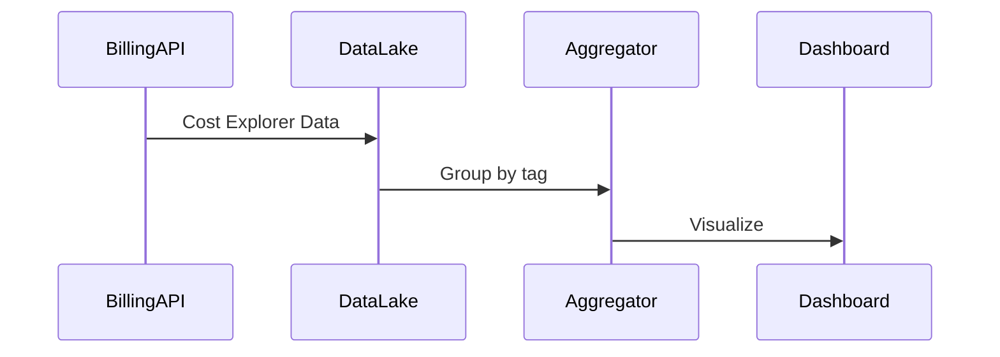

# Architecture: FinOps Cost Dashboard

## System Diagram
The following Mermaid.js sequence diagram maps the core workflow and interactions:

## Cost Management Module
The `cost/` module wraps the Azure Cost Management API. In production, it would use `azure-mgmt-costmanagement` to query actual billing data. The mock data layer simulates realistic cost breakdowns by resource group, service, and tags (team, environment).

### Key API Endpoints
- `GET /api/v1/costs/monthly` — Full cost breakdown
- `GET /api/v1/costs/by-environment` — Costs aggregated by environment tag (prod/staging/dev)
- `GET /api/v1/costs/by-team` — Costs aggregated by team tag (showback/chargeback)

## Right-Sizing Module
The `rightsizing/` module analyzes Kubernetes pod resource utilization. It compares CPU/memory requests against actual usage (from metrics-server or Prometheus) and recommends optimal resource values.

### How Right-Sizing Works
1. Query metrics-server for actual CPU/memory consumption per pod
2. Compare against the pod's resource requests
3. If actual usage is consistently below requests, recommend a lower value
4. Calculate estimated savings percentage

## FinOps Framework Alignment
This project aligns with the FinOps Foundation's three-phase model:
- **Inform**: Cost APIs provide visibility (who is spending what, where)
- **Optimize**: Right-sizing recommendations reduce waste
- **Operate**: Tag-based aggregation enables showback/chargeback to team budgets
